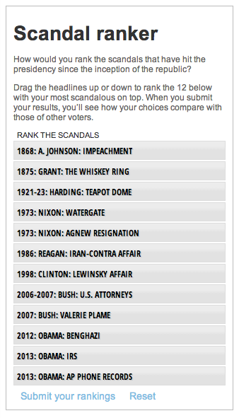

Ranker
========================

What is this?
-------------
A drag and drop news quiz to collect users' arrangements of a list of choices.
Demo: http://www.mercurynews.com/ci_23306295/dirty-dozen-how-do-you-rank-12-presidential

Credits
---------
Peggy Bustamante

Assumptions
-----------

* JQuery
* Miso

What's in here?
---------------

The project contains the following folders and important files:

* ``ranker.html`` -- main file.
* ``JS`` -- ranker.js has all the action and business logic.
* ``data`` -- Data files, in a csv format and also a SQL dump of the vote count.
* ``incl`` -- PHP file "ranker.php" for recording user's selections/votes
* ``css`` -- Base css files to get rolling with.

License
----------

This code is available under the MIT license. For more information, please see the LICENSE.txt file in this repo.
